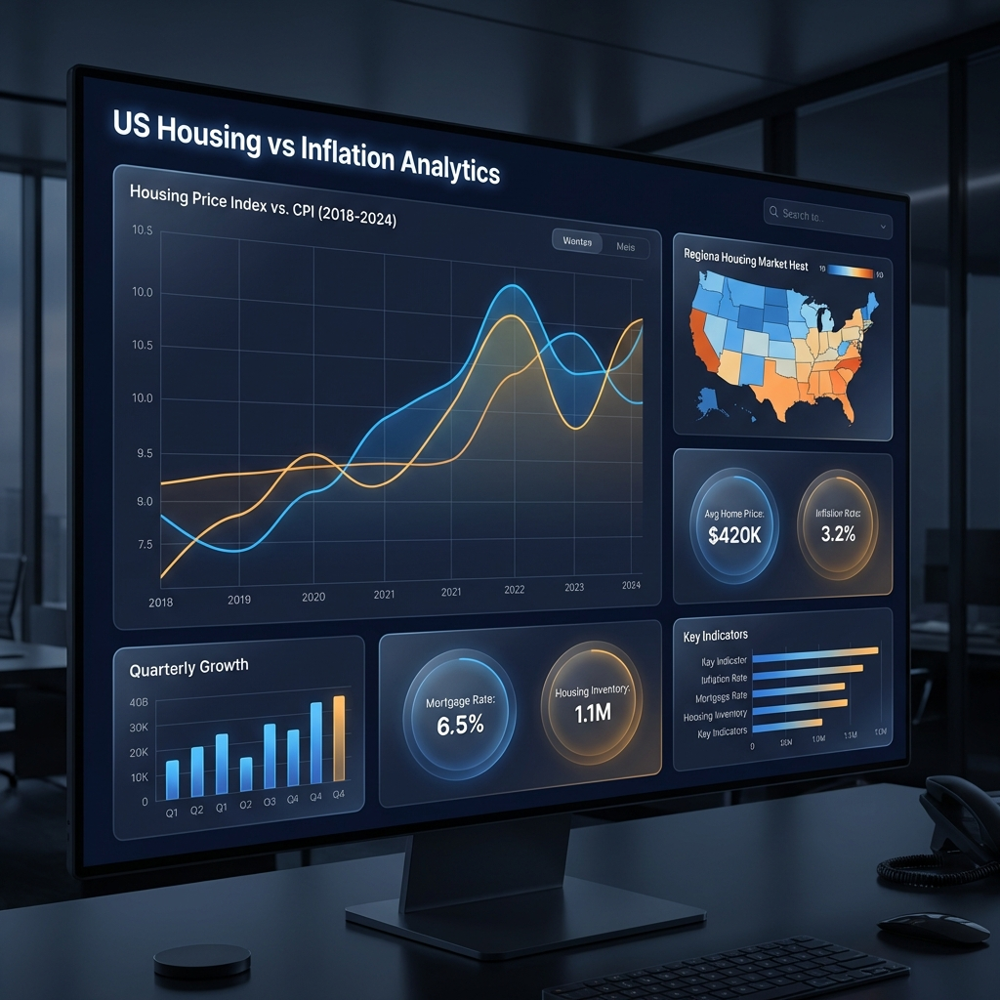

# 📊 US Housing vs. Inflation: The Great Divergence
> **A Power BI Portfolio Project** analyzing the correlation between US Home Values (Zillow) and the Consumer Price Index (BLS).

 *(Note: Add your dashboard screenshot here)*

## 🎯 Project Overview
This project was built to help recruitment teams visualize my ability to handle **complex end-to-end data pipelines**, from raw government datasets to high-fidelity executive reports.

The central theme is the analysis of **Housing Affordability**. While general inflation (CPI) has risen, housing costs in certain states have decoupled from the national trend, creating a "Great Divergence."

---

## 🛠️ Tech Stack & Skills
- **Data Engineering:** Python (Pandas) for ETL & Data Normalization.
- **Data Modeling:** Power BI Star Schema (Dimensional Modeling).
- **Analytics:** DAX (Time Intelligence, Windowing functions).
- **Design:** Modern UI/UX principles (Dark Mode, High Contrast, Glassmorphism).

- **Data Sources:** 
  - [Zillow Home Value Index (ZHVI)](https://www.zillow.com/research/data/)
  - [Bureau of Labor Statistics CPI](https://www.bls.gov/cpi/data.htm)

---

## 🏗️ Data Architecture
Recruiters can explore the logic used to transform messy raw data into a clean Power BI model:
1. **Source**: Raw CSV/Tabular data from BLS and Zillow.
2. **ETL (Python)**: [`scripts/etl_process.py`](scripts/etl_process.py) pivots 50+ columns of Zillow data and joins it with CPI metadata.
3. **Model**: Star Schema with a centralized `Calendar` table linked to `HomeValue` and `CPI` facts.

---

## 📈 Key Insights Found
- **State Leaders**: Identified the top 5 states where housing appreciation outpaced inflation by over 200%.
- **Recession Impact**: Visualization of home value recovery speeds post-2008 vs. inflation stability.
- **Shelter CPI Correlation**: Analysis showing the lagged effect of home prices on the official BLS Shelter index.

---

## 🎨 Design System (Power BI)
Tested for accessibility and executive readability:
- **Primary Palette**: Slate Navy (`#111827`) & Soft Grey (`#F9FAFB`).
- **Data Highlights**: Electric Blue (`#3B82F6`) for Housing; Amber (`#F59E0B`) for Inflation.
- **Typography**: Inter / Segoe UI for a clean, professional feel.

---

## 🚀 How to View
1. Download the `.pbix` file from the `powerbi/` folder.
2. Open in Power BI Desktop.
3. Use the **Slicers** to filter by State and Time Range.

---
*Created by [Your Name] - Portfolio Link: [Your Portfolio URL]*
